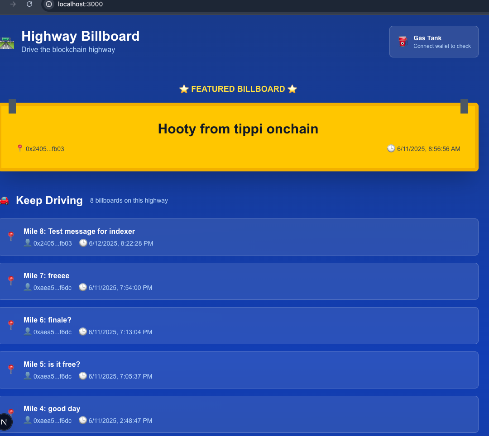

# 🛣️ Highway Billboard - Blockchain Messaging dApp

> **Drive the blockchain highway and post your messages on digital billboards!**

A production-ready blockchain messaging application showcasing the complete Aptos ecosystem: No-Code Indexer for real-time data, Gas Station for sponsored transactions, and Aptos Connect for social login - all wrapped in an intuitive highway-themed interface.



## 🎯 Project Mission

This project was **vibecoded** by [tippi fifestarr](https://github.com/tippi-fifestarr) to showcase the incredible developer tools that Aptos provides and inspire others to build their own creative dApps! 

**What makes this special:**
- **📊 No-Code Indexer** - Real-time blockchain data processing with GraphQL
- **⛽ Gas Station** - Zero-fee transactions for seamless user onboarding  
- **🔐 Aptos Connect** - Social login integration (Google OAuth)
- **🎨 Beautiful UX** - Highway metaphors make Web3 accessible to mainstream users

The beauty of blockchain contracts is that **the UX is entirely up to you!** This same billboard contract could power completely different experiences. Want to build your own? Check out the [Vibe Coder to Aptos Guide](https://aptos-learn-git-tippi-vibe-test-deploy-aptoslabs.vercel.app/en/hackathon/vibe-coder-to-aptos-guide/introduction) for prompts and guidance to get started with Aptos development.

## 🌟 Fork This & Build Your Own Billboard dApp!

The same smart contract can power infinite creative frontends. Here are some inspiring ideas:

### 🌌 **Cosmic Billboard** 
*"Name a Star, Share Your Story"*
- Transform messages into constellation patterns
- Users "buy" stars to post messages
- Cosmic theme with nebula backgrounds and twinkling animations
- Messages appear as named stars in a galaxy view

### ⚔️ **Fantastic Billboard** 
*"Quest Boards for RPG Adventures"*
- Medieval/fantasy theme with quest posting mechanics
- Messages become quests, bounties, or tavern notices
- Character avatars, guild systems, and reputation scoring
- Parchment textures and fantasy UI elements

### 🏙️ **Neon Billboard**
*"Cyberpunk Message Matrix"*
- Futuristic cityscape with holographic billboards
- Messages appear as neon signs in a 3D city
- Synthwave aesthetics with glitch effects
- Digital rain and cyberpunk styling

**Ready to build your own?** Fork this repo and let your creativity run wild! The [Vibe Coder Guide](https://aptos-learn-git-tippi-vibe-test-deploy-aptoslabs.vercel.app/en/hackathon/vibe-coder-to-aptos-guide/introduction) has everything you need to get started.

## ✨ Features

### 🚀 Production Ready (Phase 2 Complete)
- **🎨 Highway-Themed UI** - Gorgeous interface using intuitive highway metaphors
- **📱 Real-Time Data** - Live billboard updates via Aptos No-Code Indexer
- **⛽ Gas Station Integration** - Sponsored transactions for Petra wallet users
- **🔑 Social Login** - Google OAuth via Aptos Connect for seamless onboarding
- **💰 Dual Payment System** - Petra gets free transactions, social login users pay normal fees
- **🚗 Interactive Gas Gauge** - Real balance display with connect buttons
- **📍 Highway Rest Stop** - Fully functional gas station for wallet connections
- **⭐ Auto-Refresh UX** - Seamless message posting with instant updates
- **🧪 Comprehensive Testing** - Built-in test pages for all functionality

### 🎯 Highway Metaphor System
| Blockchain Concept | Highway Metaphor | UI Element |
|-------------------|------------------|------------|
| Account Balance | Gas Tank Level | ⛽ Interactive Gas Gauge |
| Wallet Connection | Gas Station Visit | 🏪 Highway Rest Stop |
| Transaction Fee | Fuel Cost | 💰 Payment Method Display |
| Message Posting | Billboard Rental | 📋 Billboard Posting Form |
| Browsing Messages | Driving Highway | 🛣️ Mile Marker Messages |
| Sponsored Transactions | Free Gas | 🎁 Gas Station Sponsorship |

## 🏗️ Technical Architecture

```
┌─────────────────┐    ┌──────────────────┐    ┌─────────────────┐
│  React Frontend │    │ Aptos Blockchain │    │ No-Code Indexer │
│                 │    │                  │    │                 │
│  Highway UI     │◄──►│  Billboard       │───►│  Real-time      │
│  + Wallet       │    │  Smart Contract  │    │  GraphQL API    │
│  + Gas Station  │    │  + Gas Station   │    │                 │
└─────────────────┘    └──────────────────┘    └─────────────────┘
```

### Smart Contract
- **Language**: Move
- **Network**: Aptos Testnet
- **Address**: `0x24051bca580d28e80a340a17f87c99def0cc0bde05f9f9d88e8eebdfad1cfb03::billboard`
- **Key Functions**:
  - `initialize_billboard` - Create new billboard
  - `send_message` - Post message to billboard (Gas Station compatible)
  - `get_all_messages` - Retrieve all messages

### Frontend Stack
- **Framework**: Next.js 15 with React 18
- **Styling**: Tailwind CSS with highway color scheme
- **Blockchain**: Aptos TypeScript SDK v1.39.0 (wallet adapter compatible)
- **Wallet Integration**: @aptos-labs/wallet-adapter-react
- **Real-time Data**: GraphQL via No-Code Indexer
- **Gas Station**: @aptos-labs/gas-station-client
- **Dev Tools**: Turbopack for fast development

## 🚀 Quick Start

### Prerequisites
- Node.js 18+
- Aptos CLI 7.4.0+
- Git

### Installation

1. **Clone the repository**
   ```bash
   git clone https://github.com/tippi-fifestarr/aptos-billboard
   cd aptos-billboard/billboard-frontend
   ```

2. **Install dependencies**
   ```bash
   npm install
   ```

3. **Set up environment variables**
   ```bash
   cp .env.example .env.local
   # Edit .env.local with your API keys (see setup instructions below)
   ```

4. **Start development server**
   ```bash
   npm run dev
   ```

5. **Visit the highway!**
   Open [http://localhost:3000](http://localhost:3000)

### Smart Contract Deployment

1. **Navigate to contract directory**
   ```bash
   cd billboard-contract
   ```

2. **Deploy to testnet**
   ```bash
   aptos move publish --named-addresses billboard=default
   ```

3. **Initialize your billboard**
   ```bash
   aptos move run --function-id default::billboard::initialize_billboard --args u64:10
   ```

4. **Post your first message**
   ```bash
   aptos move run --function-id default::billboard::send_message --args address:default string:"Hello Highway!"
   ```

## 🔧 Environment Setup

### Required API Keys

You need **two separate API keys** from [Aptos Build](https://build.aptoslabs.com):

1. **Indexer API Key** - For real-time data (GraphQL)
2. **Gas Station API Key** - For transaction sponsorship

### Step-by-Step Configuration

1. **Create Indexer Project**
   - Go to [Aptos Build](https://build.aptoslabs.com)
   - Create a new "No-Code Indexer" project
   - Configure it to index your billboard contract events
   - Copy the GraphQL endpoint URL and API key

2. **Create Gas Station Project**
   - Create a new "Gas Station" configuration
   - Set network to **TESTNET** (required)
   - Whitelist contract function: `send_message`
   - Copy the API key

3. **Update .env.local**
   ```env
   # Indexer Configuration
   NEXT_PUBLIC_INDEXER_API_URL=https://api.testnet.aptoslabs.com/nocode/v1/api/YOUR_ID/v1/graphql
   NEXT_PUBLIC_INDEXER_API_KEY=aptoslabs_YOUR_INDEXER_KEY

   # Gas Station Configuration
   NEXT_PUBLIC_GAS_STATION_API_KEY=aptoslabs_YOUR_GAS_STATION_KEY
   ```

**Need help getting started?** The [Vibe Coder to Aptos Guide](https://aptos-learn-git-tippi-vibe-test-deploy-aptoslabs.vercel.app/en/hackathon/vibe-coder-to-aptos-guide/introduction) has detailed prompts and step-by-step instructions for Aptos development.

## 🧪 Testing & Verification

The project includes comprehensive testing infrastructure:

### Built-in Test Pages
- **`/test-indexer`** - Verify real-time data functionality
- **`/test-wallet`** - Test wallet connections and transactions
- **`/test-integration`** - Complete end-to-end testing

### Testing Workflow
1. Start with `/test-indexer` to verify data flow
2. Use `/test-wallet` to test wallet functionality
3. Run `/test-integration` for full system verification
4. Test main app at `/` for production experience

## 🚀 Vercel Deployment

### Environment Variables for Production

In your Vercel dashboard, add these environment variables:

```env
NEXT_PUBLIC_INDEXER_API_URL=https://api.testnet.aptoslabs.com/nocode/v1/api/YOUR_ID/v1/graphql
NEXT_PUBLIC_INDEXER_API_KEY=aptoslabs_YOUR_INDEXER_KEY
NEXT_PUBLIC_GAS_STATION_API_KEY=aptoslabs_YOUR_GAS_STATION_KEY
```

### Deployment Steps

1. **Connect Repository**
   ```bash
   # Push to GitHub
   git add .
   git commit -m "Ready for production deployment"
   git push origin main
   ```

2. **Deploy to Vercel**
   - Connect your GitHub repository to Vercel
   - Set environment variables in Vercel dashboard
   - Deploy automatically on push

3. **Verify Deployment**
   - Test wallet connections work on production domain
   - Verify real-time data updates
   - Test both Petra and social login flows

### Production Considerations

- **Network**: Ensure all components use Testnet
- **CORS**: Aptos Build APIs are configured for frontend use
- **Performance**: Next.js optimizations included for fast loading
- **Error Handling**: Comprehensive error boundaries implemented

## 📊 No-Code Indexer Integration

### Real-time Data Flow
```
Smart Contract Event → Indexer Processing → GraphQL API → React UI
```

### Configuration Details
- **Event Source**: `MessageAdded` events from billboard contract
- **Database Schema**: 
  - `author_address` (blockchain address)
  - `time` (timestamp in microseconds)
  - `message` (billboard content)
- **API Type**: GraphQL with automatic schema generation

### Key Benefits
✅ **Real-time Updates**: Instant message display without polling  
✅ **Type Safety**: Generated TypeScript types from GraphQL schema  
✅ **Scalability**: Handles high-frequency blockchain events  
✅ **Developer Experience**: GraphQL playground for testing queries

## ⛽ Gas Station Integration

### Sponsored Transaction Flow
```
User Action → Wallet Detection → Gas Station API → Sponsored Transaction
```

### Implementation Details
- **Petra Wallet**: Automatic sponsorship for all transactions
- **Social Login**: Normal transactions (user pays gas fees)
- **Rate Limiting**: Built-in protection against abuse
- **Error Handling**: Graceful fallback to normal transactions

### Benefits for Users
- **Zero Friction**: Petra users post messages for free
- **Instant Onboarding**: No need to acquire test APT
- **Familiar UX**: Gas station metaphor makes sponsorship intuitive

## 🔐 Wallet Integration

### Supported Wallets
- **Petra Wallet** - Full gas station sponsorship support
- **Aptos Connect** - Social login with Google OAuth
- **Other Wallets** - Standard Aptos wallet adapter support

### Auto-Detection System
The app automatically detects wallet type and adjusts payment flow:
- Petra → Sponsored transactions via Gas Station
- Social Login → Normal transactions with clear fee display
- Other Wallets → Standard transaction flow

## 📈 Live Data & Analytics

**Production Stats**:
- 🎯 **Real-time Message Processing** via No-Code Indexer
- ⛽ **Gas Station Sponsorship** for seamless UX
- 👥 **Multi-wallet Support** (Petra + Social Login)
- 🏆 **Production Ready** with comprehensive testing

## 🛣️ Project Phases

### ✅ Phase 1: Foundation (Complete)
- [x] Smart contract deployment
- [x] No-code indexer integration  
- [x] Highway-themed frontend
- [x] Real-time message display

### ✅ Phase 2: Full Integration (Complete)
- [x] Wallet adapter integration
- [x] Gas Station transaction sponsoring
- [x] Aptos Connect social login
- [x] Dual payment system implementation
- [x] Interactive gas gauge with connect buttons
- [x] Auto-refresh UX for seamless posting
- [x] Comprehensive testing infrastructure

### 🎯 Phase 3: Optional Enhancements
- [ ] Message reactions and threading
- [ ] User profiles and avatars
- [ ] Advanced search and filtering
- [ ] Analytics dashboard
- [ ] 3D highway visualization
- [ ] Weather effects and day/night cycle

## 🔧 Key Files Structure

```
billboard-frontend/
├── src/
│   ├── components/
│   │   ├── Highway/HighwayBillboard.tsx    # Main component with full integration
│   │   └── providers/WalletProvider.tsx    # Wallet context and configuration
│   ├── hooks/
│   │   └── useWallet.ts                    # Wallet state management
│   ├── services/
│   │   └── gasStation.ts                   # Transaction sponsorship logic
│   ├── lib/
│   │   ├── indexerClient.ts                # Real-time data client
│   │   └── billboardService.ts             # Blockchain interaction
│   ├── types/
│   │   └── index.ts                        # TypeScript definitions
│   ├── utils/
│   │   └── constants.ts                    # Configuration and theme
│   └── app/
│       ├── page.tsx                        # Main highway interface
│       ├── test-indexer/page.tsx           # Indexer testing
│       ├── test-wallet/page.tsx            # Wallet testing
│       └── test-integration/page.tsx       # Full integration testing
├── .env.example                            # Environment setup guide
└── package.json                            # Dependencies and scripts
```

## 🐛 Troubleshooting

### Common Issues

**Wallet Connection Issues**
- Ensure you're on Testnet network
- Check browser console for detailed error messages
- Verify API keys are correctly formatted

**Gas Station Not Working**
- Confirm Gas Station API key is valid
- Ensure contract function is whitelisted
- Check network is set to Testnet (required)

**Real-time Data Issues**
- Verify Indexer API URL and key
- Check GraphQL endpoint accessibility
- Ensure contract events are being indexed

### Debug Tools
- Use `/test-indexer` to isolate data issues
- Use `/test-wallet` to debug wallet connections
- Check browser console for detailed error logs
- Verify environment variables are loaded correctly

## 🤝 Contributing

We welcome contributions that improve the developer experience and showcase Aptos Build features!

### Development Setup
1. Fork the repository
2. Create feature branch (`git checkout -b feature/amazing-feature`)
3. Make changes and test thoroughly using built-in test pages
4. Submit pull request with detailed description

### Feedback Areas
- **Gas Station UX** improvements and edge cases
- **Highway UI/UX** enhancements and accessibility  
- **Wallet Integration** additional wallet support
- **Documentation** improvements and tutorials

## 📖 Documentation

- [Environment Setup Guide](./.env.example) - Complete configuration instructions
- [API Keys Guide](./APTOS-API-KEYS-GUIDE.md) - Comprehensive guide to Aptos Build API keys
- [Integration Plan](./integration-plan.md) - Technical implementation details
- [Phase 1 Summary](./phase-1-summary.md) - Development journey pt 1
- [Phase 2 Summary](./phase-2-summary.md) - Full integration completion
- [Vibe Coder Guide](https://aptos-learn-git-tippi-vibe-test-deploy-aptoslabs.vercel.app/en/hackathon/vibe-coder-to-aptos-guide/introduction) - Get started building on Aptos

## 📞 Support & Contact

**Project Creator**: [tippi fifestarr](https://github.com/tippi-fifestarr)  
**Purpose**: Showcase Aptos Build ecosystem and inspire creative dApp development

For technical questions or feedback:
- Create GitHub issue with detailed description
- Include console logs and steps to reproduce
- Use built-in test pages to isolate issues
- Tag with appropriate labels (bug/enhancement/feedback)

---

## 🎉 Acknowledgments

Special thanks to:
- **Aptos Labs** for innovative blockchain infrastructure and responsive support
- **Community Contributors** who tested the platform and provided feedback
- **Highway Travelers** who posted messages and helped validate the UX! 🚗
- **Future Builders** who will fork this and create amazing new experiences! 🌟

---

*Vibecoded with ❤️ for the Aptos ecosystem*

**Ready to drive the blockchain highway? Your gas tank is full! ⛽🚗💨**

**Want to build your own billboard dApp?** Check out the [Vibe Coder to Aptos Guide](https://aptos-learn-git-tippi-vibe-test-deploy-aptoslabs.vercel.app/en/hackathon/vibe-coder-to-aptos-guide/introduction) and let your creativity run wild! 🚀